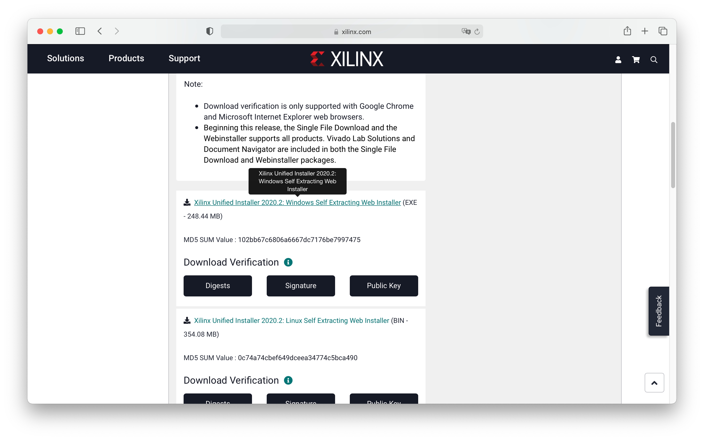
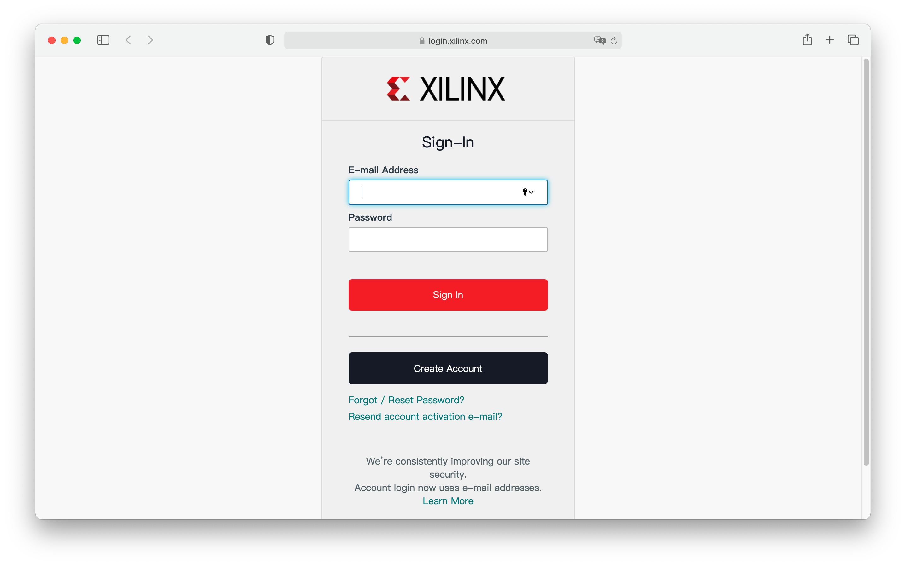
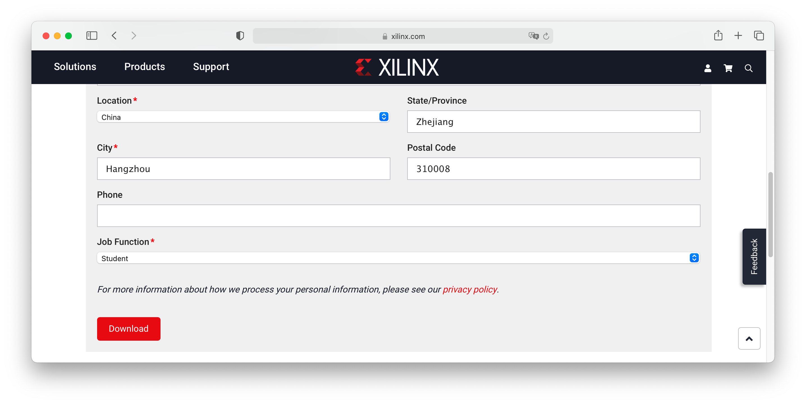
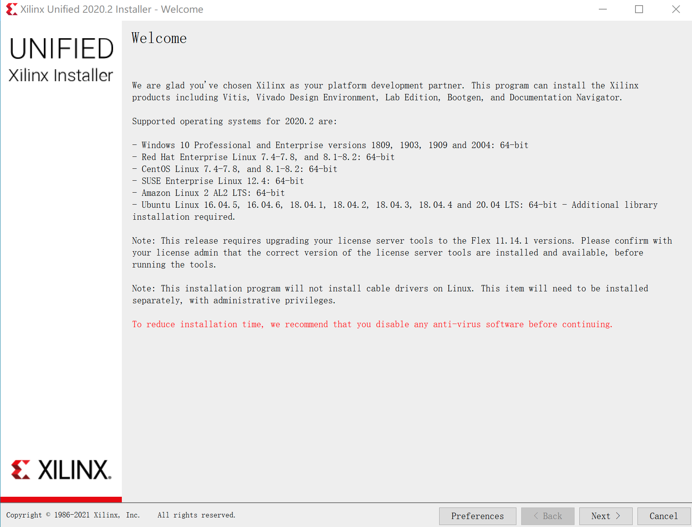
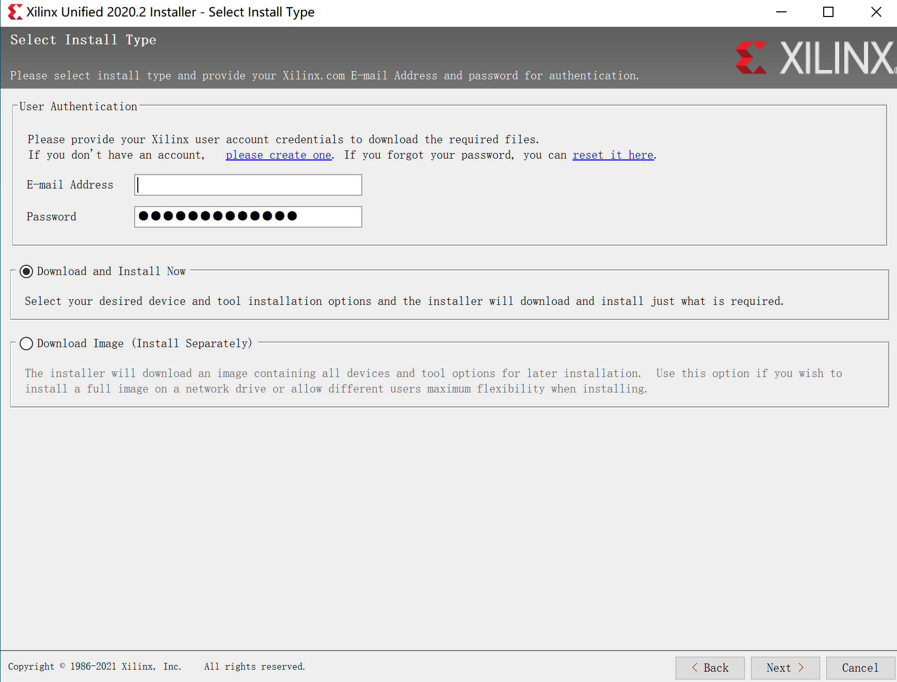
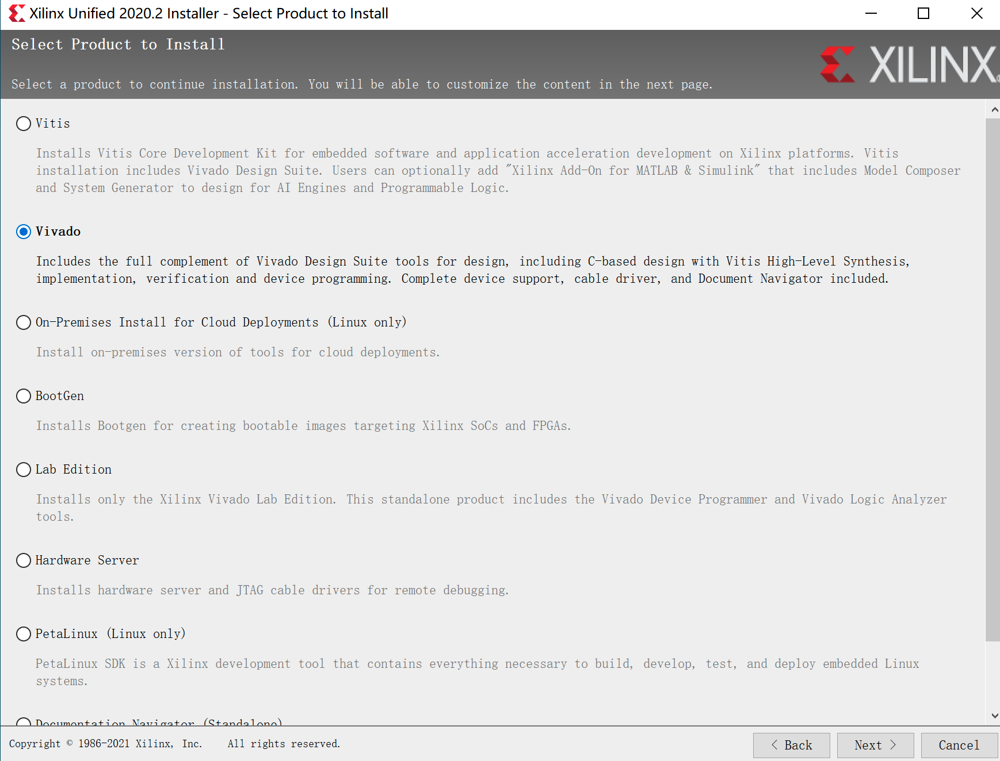
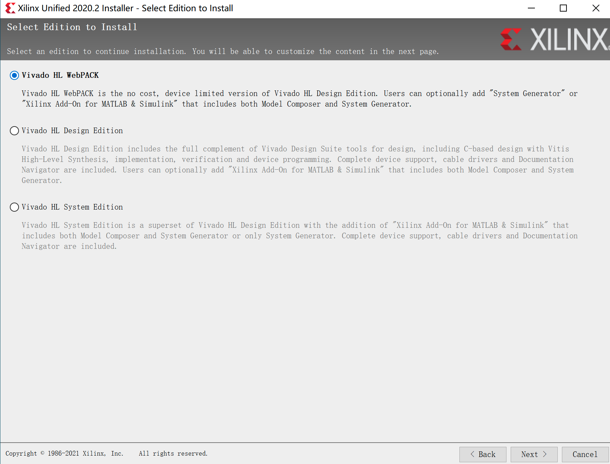
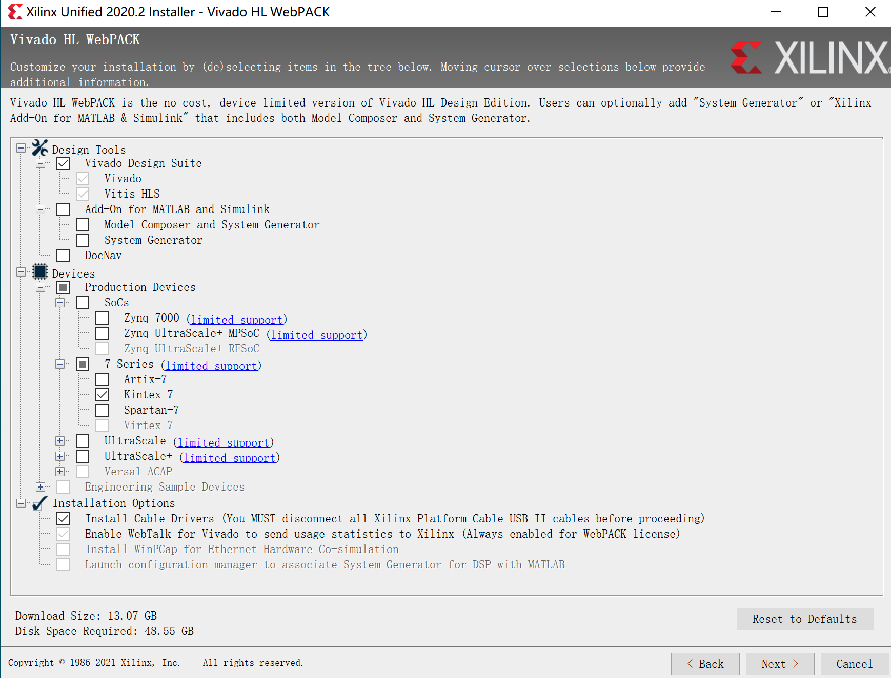
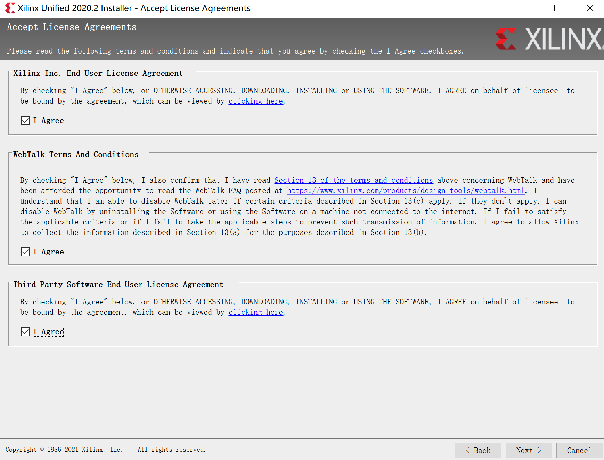
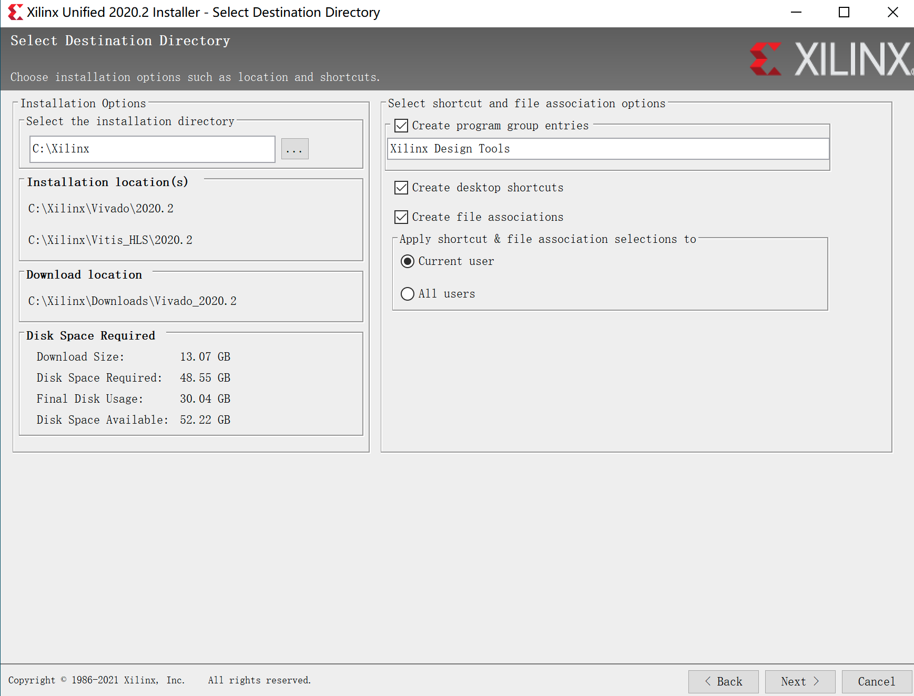

# Vivado的安装（Win10）

首先从[官方网站](https://www.xilinx.com/support/download.html)下载安装器。

接下来登录Xilinx账户用于下载安装器。

填写表单后，将会出现可点击的**Download**按钮。（只需要第一次下载时填写，之后表单的内容将自动保存）

下载得到安装器后直接打开，得到如下的页面。

在安装器中也要登录Xilinx账户。

选择安装vivado。

选择安装webpack（免费）。

选择模组（图中选项为最小化安装）。

同意三个协议。

选择安装路径。

然后将开始下载。要注意为Vivado留大约50GB左右的空间。下载量大约为13GB。安装完毕即可。